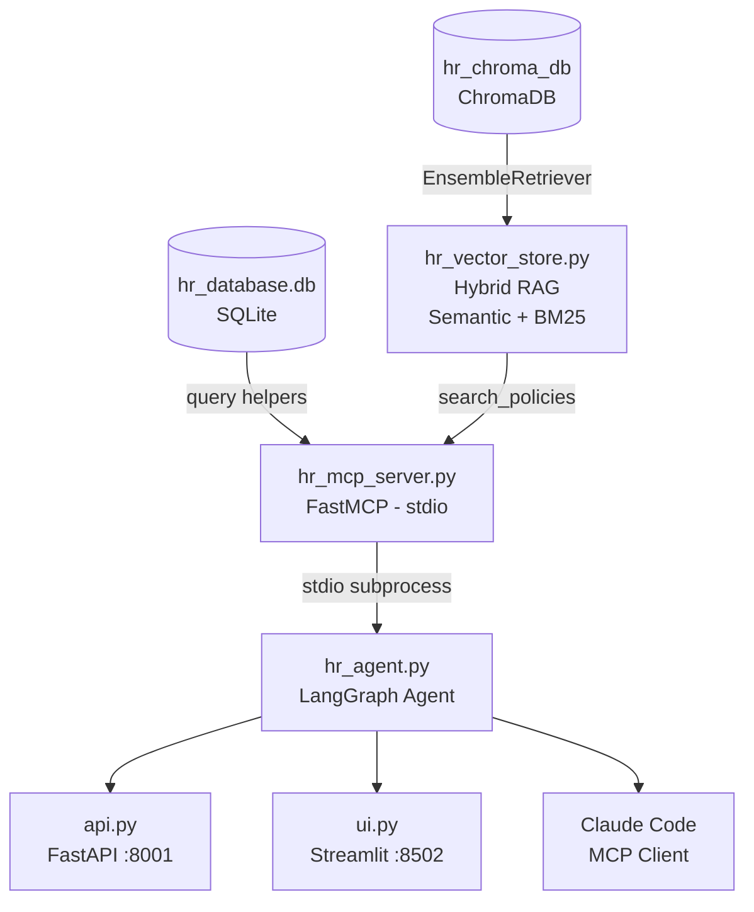
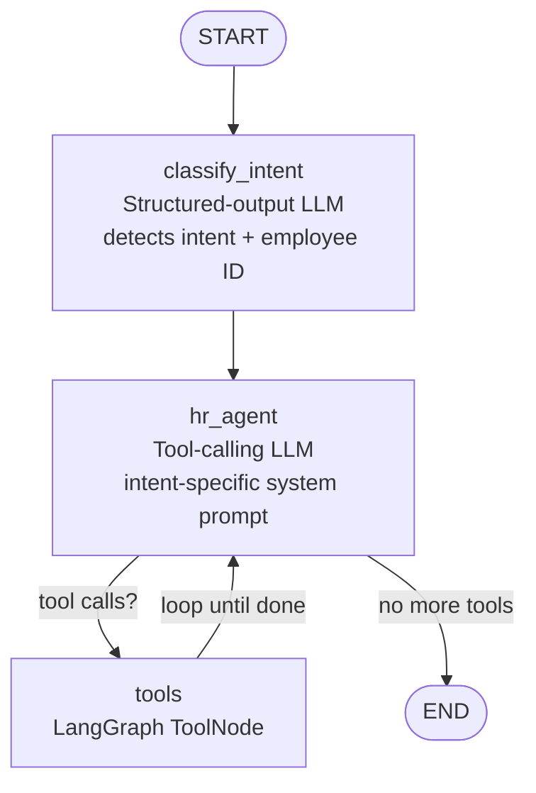
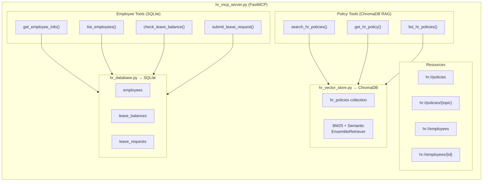

# HR Management Agent

An AI-powered HR assistant built with **LangGraph**, **FastMCP**, and **GPT-4o-mini**. Employee data is stored in **SQLite** and served via the MCP server. HR policies are stored in a **ChromaDB vector store** and retrieved via **hybrid RAG** (semantic + BM25). The agent classifies requests by intent and routes them to the right tools.

---

## Architecture

### System Overview



### LangGraph Flow



### MCP Server Structure



### LangGraph Nodes

| Node | Role |
|---|---|
| `classify_intent` | Structured-output LLM — detects intent and extracts employee ID |
| `hr_agent` | Tool-calling LLM with an intent-specific system prompt |
| `tools` | LangGraph `ToolNode` — executes whichever tools the LLM requested |

### Intents

| Intent | Triggers on |
|---|---|
| `leave_management` | PTO, vacation, sick days, leave requests and balances |
| `policy_question` | Remote work, conduct, compensation, leave rules |
| `onboarding` | New-hire checklists, first-week guides, account setup |
| `recruitment` | Interview questions, job descriptions, hiring advice |
| `performance_review` | Review process, ratings, PIPs, feedback frameworks |
| `general` | Anything that doesn't fit the above |

---

## Project Structure

```
HR Agent App/
├── hr_mcp_server.py   # FastMCP server — RAG policy tools + employee tools (SQLite)
├── hr_vector_store.py # ChromaDB vector store + hybrid BM25/semantic retriever
├── hr_chroma_db/      # Persisted ChromaDB collection (auto-created on first run)
├── hr_database.py     # SQLite setup, schema, seed data, query helpers
├── hr_database.db     # SQLite database (auto-created on first run)
├── hr_agent.py        # LangGraph agent — routes all tools through MCP
├── api.py             # FastAPI server  →  POST /hr/chat
├── ui.py              # Streamlit chat UI (loads employees from SQLite)
├── requirements.txt   # Python dependencies
└── README.md
```

---

## HR Tools

| Tool | Backed by | Description |
|---|---|---|
| `search_hr_policies` | MCP → ChromaDB RAG | Hybrid semantic + BM25 search across all policies |
| `get_hr_policy` | MCP → ChromaDB | Exact topic lookup with semantic fallback |
| `list_hr_policies` | MCP → ChromaDB | Lists all policy topics with descriptions |
| `get_employee_info` | MCP → SQLite | Employee profile by ID |
| `list_employees` | MCP → SQLite | All employees with role and department |
| `check_leave_balance` | MCP → SQLite | Annual / sick / personal day balances |
| `submit_leave_request` | MCP → SQLite | Validates, persists leave request to DB |
| `generate_onboarding_checklist` | Local (generative) | Week-by-week checklist with dept-specific items |
| `generate_interview_questions` | Local (generative) | Behavioral / technical / cultural Qs by role |

### MCP Resources

| URI | Description |
|---|---|
| `hr://policies` | Lists all available policy topics |
| `hr://policies/{topic}` | Full policy text for a specific topic (ChromaDB-backed) |
| `hr://employees` | Table of all employees from SQLite |
| `hr://employees/{id}` | Profile for a specific employee from SQLite |

### Policy Topics

| Topic | Covers |
|---|---|
| `remote_work` | Remote days, core hours, equipment allowance |
| `leave` | Annual, sick, personal, parental, bereavement |
| `performance` | Review cycle, rating scale, PIPs, merit increases |
| `code_of_conduct` | Respect, harassment, conflicts of interest |
| `compensation` | Equity, health insurance, 401(k), L&D budget |

---

## Vector Store (ChromaDB RAG)

HR policies are stored as documents in a persistent **ChromaDB** collection and retrieved using **hybrid search**.

### How it works

| Layer | Detail |
|---|---|
| **Storage** | `PersistentClient` at `./hr_chroma_db` — auto-seeded on first import |
| **Embeddings** | `text-embedding-3-small` (OpenAI) |
| **Semantic search** | ChromaDB cosine similarity retriever |
| **Keyword search** | BM25Retriever over the same policy documents |
| **Fusion** | `EnsembleRetriever` with 50/50 weights — Reciprocal Rank Fusion (RRF) |

### Key functions in `hr_vector_store.py`

| Function | Description |
|---|---|
| `init_vector_store()` | Load or create ChromaDB collection; seeds if empty |
| `search_policies(query, k)` | Hybrid RAG search — returns up to k ranked results |
| `get_policy_by_topic(topic)` | Exact / partial topic match (no embedding needed) |
| `list_policy_topics()` | All topics with short descriptions |

---

## SQLite Database

The database is created automatically on first run at `hr_database.db`.

### Tables

| Table | Columns |
|---|---|
| `employees` | employee_id, name, department, role, manager_id, start_date, email |
| `leave_balances` | employee_id, annual, sick, personal |
| `leave_requests` | request_id, employee_id, leave_type, start_date, end_date, days, reason, status, submitted_at |

### Seed Data

| ID | Name | Role | Department | Annual | Sick | Personal |
|---|---|---|---|---|---|---|
| E001 | Alice Johnson | Senior Engineer | Engineering | 15 | 10 | 3 |
| E002 | Bob Smith | Marketing Manager | Marketing | 12 | 10 | 3 |
| E003 | Carol White | VP Engineering | Engineering | 20 | 10 | 5 |
| E004 | David Brown | CMO | Marketing | 20 | 10 | 5 |

---

## Setup

### 1. Install dependencies

```bash
cd "HR Agent App"
pip install -r requirements.txt
```

### 2. Environment variables

The agent loads `.env` from the **project root** (one level up):

```
OPENAI_API_KEY=sk-...
```

The SQLite database and ChromaDB vector store are created automatically — no additional setup needed.

---

## Running the App

Run each component in a **separate terminal**, in this order:

### Step 1 — MCP Server (policies + employee data)

```bash
cd "HR Agent App"
python hr_mcp_server.py
```

Starts in **stdio mode** — spawned automatically as a subprocess when the agent calls a tool.
On first run, `hr_vector_store.py` seeds the 5 HR policy documents into ChromaDB.

### Step 2 — FastAPI Server

```bash
cd "HR Agent App"
python api.py
# → http://localhost:8001
```

**Endpoints:**

| Method | Path | Description |
|---|---|---|
| `GET` | `/` | Health check |
| `POST` | `/hr/chat` | Submit an HR request |

**Request body:**
```json
{
  "message": "What is my leave balance?",
  "employee_id": "E001"
}
```

**Response:**
```json
{
  "answer": "Alice, you have 15 annual, 10 sick, and 3 personal days remaining.",
  "intent": "leave_management",
  "tools_used": ["check_leave_balance"],
  "employee_id": "E001"
}
```

### Step 3 — Streamlit Chat UI

```bash
cd "HR Agent App"
streamlit run ui.py --server.port 8502
```

Open [http://localhost:8502](http://localhost:8502)

**Sidebar features:**
- Employee selector loads directly from SQLite (`hr_database.db`)
- Quick-prompt buttons for common HR tasks
- Expandable "Tools used" metadata panel on each response

---

## MCP Inspector (Debugging)

Test the MCP server interactively — browse resources, call tools, and inspect protocol messages.

### Launch the Inspector

```bash
# Kill any leftover inspector processes, then launch
lsof -ti :6274,:6277 | xargs kill -9 2>/dev/null; mcp dev "HR Agent App/hr_mcp_server.py"
```

> Run from the **project root** (one level above `HR Agent App/`), or adjust the path accordingly.

Inspector opens at **[http://localhost:6274](http://localhost:6274)**

### Inspector Tabs

| Tab | What you can do |
|---|---|
| **Resources** | Read `hr://policies/{topic}` and `hr://employees/{id}` |
| **Tools** | Test all MCP tools live with custom inputs |
| **Notifications** | View server logs and protocol messages |

### Example Tool Inputs for Testing

**`search_hr_policies`** — hybrid RAG search (try open-ended queries):
```json
{ "query": "parental leave weeks", "k": 2 }
{ "query": "401k match", "k": 1 }
{ "query": "harassment reporting" }
```

**`get_hr_policy`** — exact topic lookup:
```json
{ "topic": "remote_work" }
{ "topic": "compensation" }
```

**`check_leave_balance`** — SQLite query:
```json
{ "employee_id": "E001" }
```

**`submit_leave_request`** — persists to SQLite:
```json
{
  "employee_id": "E001",
  "leave_type": "annual",
  "start_date": "2025-06-01",
  "end_date": "2025-06-05",
  "reason": "Family holiday"
}
```

### Kill Inspector Ports (if already in use)

```bash
lsof -ti :6274,:6277 | xargs kill -9 2>/dev/null
```

---

## Claude Code Integration

The MCP server is registered with Claude Code for this project:

```bash
claude mcp list   # verify registration
```

Configuration in `~/.claude.json`:
```json
"hr-policies": {
  "type": "stdio",
  "command": "python3",
  "args": ["/Users/trainer/Agentic AI Feb 2026/HR Agent App/hr_mcp_server.py"]
}
```

Claude Code can call all MCP tools (employee lookup, leave, policies) directly in this workspace.

---

## Example Queries

| Query | Intent | Tools Called |
|---|---|---|
| `What is the sick leave policy?` | `policy_question` | `search_hr_policies` → ChromaDB |
| `What is the remote work policy?` | `policy_question` | `get_hr_policy` → ChromaDB |
| `What are the parental leave entitlements?` | `policy_question` | `search_hr_policies` → ChromaDB |
| `What is my leave balance?` | `leave_management` | `check_leave_balance` → SQLite |
| `Submit annual leave for E001 from 2025-04-01 to 2025-04-05` | `leave_management` | `submit_leave_request` → SQLite |
| `Show me details for employee E002` | `general` | `get_employee_info` → SQLite |
| `Generate an onboarding checklist for a new engineer starting 2025-03-01` | `onboarding` | `generate_onboarding_checklist` |
| `Give me behavioral interview questions for a Senior Software Engineer` | `recruitment` | `generate_interview_questions` |
| `How does the performance review process work?` | `performance_review` | `get_hr_policy` → ChromaDB |

---

## Tech Stack

| Component | Library |
|---|---|
| Agent framework | `langgraph` |
| MCP server | `mcp[cli]` (FastMCP) |
| Vector store | `chromadb` + `langchain-chroma` |
| Hybrid retrieval | `langchain-classic` (EnsembleRetriever) + `rank-bm25` (BM25Retriever) |
| Embeddings | `langchain-openai` (`text-embedding-3-small`) |
| Database | `sqlite3` (built-in) |
| LLM | `langchain-openai` (GPT-4o-mini) |
| API server | `fastapi` + `uvicorn` |
| Chat UI | `streamlit` |
| Env management | `python-dotenv` |
