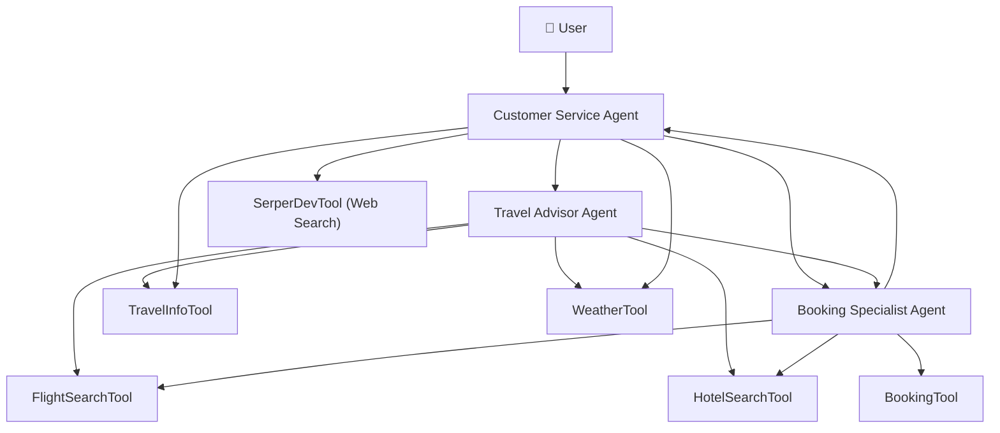
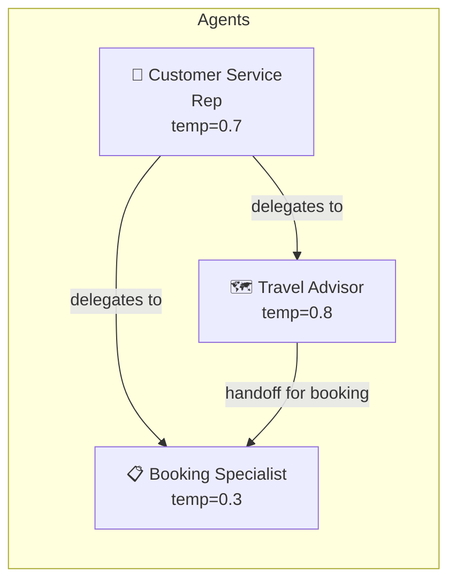
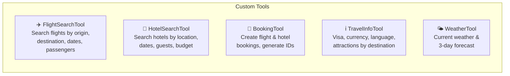
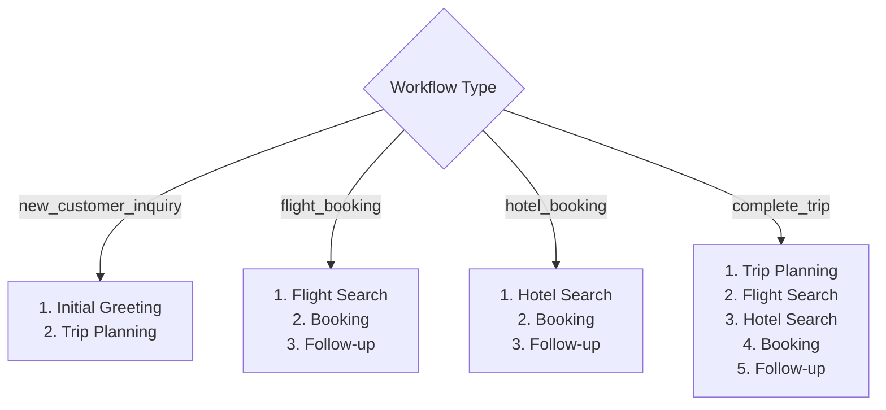
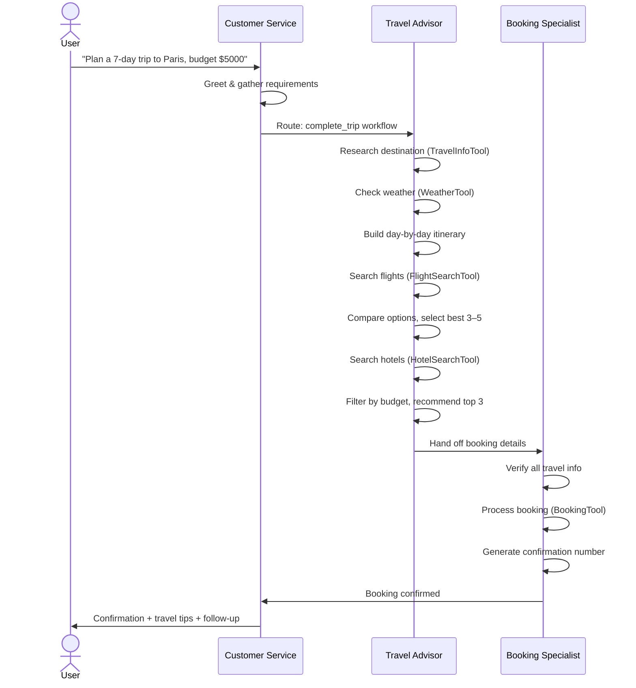
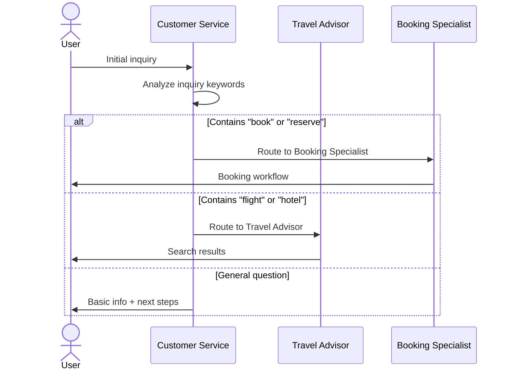
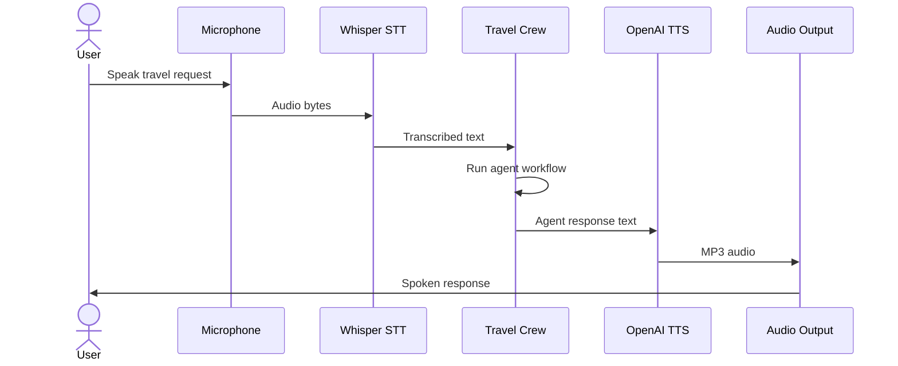
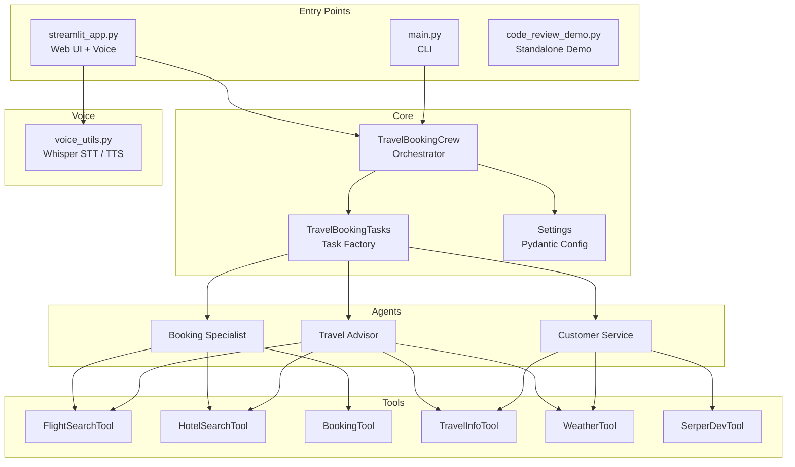

# CrewAI Travel Agent

A multi-agent AI travel booking system built with [CrewAI](https://crewai.com), featuring intelligent agents for travel planning, booking, and customer service — with optional voice interaction via OpenAI Whisper and TTS.

---

## Table of Contents

- [Overview](#overview)
- [Project Structure](#project-structure)
- [Agents](#agents)
- [Tools](#tools)
- [Workflows](#workflows)
- [Agent Sequence Diagrams](#agent-sequence-diagrams)
- [Setup](#setup)
- [Running the App](#running-the-app)

---

## Overview



---

## Project Structure

```
crew-ai-travelagent/
├── agents/
│   ├── travel_advisor_agent.py      # Travel recommendations & itinerary planning
│   ├── booking_agent.py             # Booking processing & confirmation
│   └── customer_service_agent.py    # Customer intake & routing
├── core/
│   ├── travel_booking_crew.py       # Crew orchestration & workflow methods
│   └── crew_tasks.py                # Task definitions for each workflow step
├── tools/
│   └── travel_tools.py              # 5 custom tools (Flight, Hotel, Booking, Info, Weather)
├── config/
│   └── settings.py                  # Pydantic settings (temperatures, flags)
├── main.py                          # CLI entry point
├── streamlit_app.py                 # Web UI with voice support
├── voice_utils.py                   # OpenAI Whisper STT + TTS helpers
├── code_review_demo.py              # Standalone code review demo
├── requirements.txt
└── .env.example
```

---

## Agents



### Customer Service Representative

| Attribute | Value |
|-----------|-------|
| **Goal** | Understand customer needs and route to appropriate specialists |
| **Temperature** | 0.7 (balanced, friendly) |
| **Allow Delegation** | Yes |
| **Tools** | TravelInfoTool, WeatherTool, SerperDevTool |

Greets customers, gathers trip requirements, and routes them to the Travel Advisor or Booking Specialist.

---

### Travel Advisor

| Attribute | Value |
|-----------|-------|
| **Goal** | Provide personalized travel recommendations and create comprehensive itineraries |
| **Temperature** | 0.8 (creative, exploratory) |
| **Allow Delegation** | Yes |
| **Tools** | FlightSearchTool, HotelSearchTool, TravelInfoTool, WeatherTool |

Researches destinations, finds flights and hotels, builds day-by-day itineraries, and considers weather and seasonal factors.

---

### Booking Specialist

| Attribute | Value |
|-----------|-------|
| **Goal** | Accurately process travel bookings and provide confirmation |
| **Temperature** | 0.3 (precise, deterministic) |
| **Allow Delegation** | No |
| **Tools** | FlightSearchTool, HotelSearchTool, BookingTool |

Verifies all details, processes bookings with 100% accuracy, generates confirmation numbers, and handles modifications/cancellations.

---

## Tools



| Tool | Input | Output |
|------|-------|--------|
| **FlightSearchTool** | origin, destination, dates, passengers | 3 flight options with airline, price, duration |
| **HotelSearchTool** | destination, check-in/out, guests, max budget | 3 hotel options with ratings, amenities, price |
| **BookingTool** | booking type, details, customer info | Booking ID (`BK{timestamp}`), confirmation number |
| **TravelInfoTool** | destination, info type | Visa requirements, currency, attractions, best time |
| **WeatherTool** | destination, days | 3-day forecast with condition, temps, precipitation |

> **Note:** All tools use mock/simulated data. No external travel API key is required.

---

## Workflows

Four built-in workflows define which tasks and agents are activated:



### Tasks

| Task | Agent | Description |
|------|-------|-------------|
| **Initial Greeting** | Customer Service | Greet customer, gather needs, determine routing |
| **Trip Planning** | Travel Advisor | Full itinerary with activities, costs, and alternatives |
| **Flight Search** | Travel Advisor | Compare 3–5 flight options with pros/cons |
| **Hotel Search** | Travel Advisor | Curate 3–4 hotel picks with reviews and policies |
| **Booking** | Booking Specialist | Verify, process, confirm — generate booking ID |
| **Customer Follow-up** | Customer Service | Confirm satisfaction, offer travel tips and add-ons |

---

## Agent Sequence Diagrams

### Complete Trip Planning



---

### Customer Inquiry Routing



---

### Voice Interaction Flow (Streamlit)



---

## Setup

### Prerequisites

- Python 3.10+
- OpenAI API key

### Install

```bash
cd crew-ai-travelagent

# Create and activate virtual environment
python -m venv venv
source venv/bin/activate       # macOS/Linux
# venv\Scripts\activate        # Windows

# Install dependencies
pip install -r requirements.txt
```

### Configure Environment

```bash
cp .env.example .env
```

Edit `.env` and set your keys:

```env
OPENAI_API_KEY=sk-...

# Optional — mock data is used if not provided
TRAVEL_API_KEY=your_travel_api_key_here
TRAVEL_API_BASE_URL=https://api.travelbooking.com

# Agent settings (defaults shown)
CUSTOMER_SERVICE_TEMPERATURE=0.7
TRAVEL_ADVISOR_TEMPERATURE=0.8
BOOKING_AGENT_TEMPERATURE=0.3
MAX_ITERATIONS=10
VERBOSE=true
```

---

## Running the App

### Option 1 — CLI (Interactive)

```bash
python main.py
```

Presents a menu to choose a workflow, prompts for trip requirements, and runs the full agent crew in the terminal.

### Option 2 — Streamlit Web UI (with Voice)

```bash
streamlit run streamlit_app.py
```

Opens a browser-based chat interface with:
- Voice input (OpenAI Whisper)
- Voice output with selectable voice (`alloy`, `echo`, `fable`, `nova`, `onyx`, `shimmer`)
- Text input fallback
- Chat history

### Option 3 — Code Review Demo

A standalone CrewAI demo with a Coder + Reviewer agent pair that writes and reviews Python code.

```bash
python code_review_demo.py
```

---

## Architecture Summary


